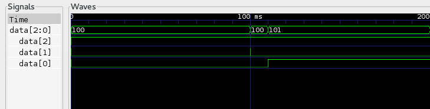

The Qemu scenario engine demonstration
======================================

## The scenario engine
The Qemu scenario engine is a framework designed to test the software running
on the guest machine.  It allows interacting with the guest virtual devices by
stimulating inputs and reading outputs from outside of the virtual machine.
It also provides an utility to schedule precise time based events to run
through a "test scenario".

## The demonstration
This demonstration runs a bare metal ARM guest software on Qemu 2.4.0 patched
with the scenario engine.

The bare metal software puts the GPIO pin 2 high when initialized.
It waits for GPIO pin 1 to get high, then starts a 10ms timer. When this timer
expires, it toggles the GPIO pin 0.

The purpose of the example test scenario is to find the guest delay for
toggling the GPIO pin 0 after timer expiration.  This scenario schedules
multiple event sequences. A sequence sends a signal on GPIO pin 1 then check
for GPIO pin 0 value after 10ms + delta. The delta value varies between
sequences from 20ns to 60ns.  For each sequence, the result is printed to
stdout ("Toggle error" or "Toggle okay").

The example scenario also traces all events from the GPIO controller. The
generated trace files can be converted into VCD trace files to visualize the
virtual GPIO signal.

### Example of output trace as seen with GTK Wave


Running the demonstration
=========================

## Automatic demo script
The `run_demo.sh` script can be used to automatically run the scenario engine
demonstration. It will clone qemu, patch it then run and generate a VCD file
with some GPIO pin signals.
It will ask for visualization if GTK Wave is found.

## Manual demonstration
All the following commands should be run from the root of the demonstration
directory.

### Cloning and patching Qemu

#### Clone Qemu
First, clone the Qemu project into the demo directory then get to the 2.4.0
version (Qemu version known working with the patches)

```bash
git clone git://git.qemu-project.org/qemu.git
cd qemu
git checkout v2.4.0
```

#### Patch Qemu
Apply the scenario engine patches to Qemu

```bash
cd qemu
git apply ../scenario_engine_patch/*
```

### Compile Qemu
Now, build Qemu into ./bin/arm-scenario.
Some options have to be enabled to run this demo:

```bash
cd qemu
mkdir -p bin/arm-scenario && cd bin/arm-scenario
../../configure \
        --enable-debug \
        --target-list=arm-softmmu \
        --audio-drv-list= \
        --enable-trace-backend=simple \
        --enable-scenario-engine
make
```

Some have to add `--python=/usr/bin/python2` to the configure script if their
default python binary points to python3.
The `-j` make option is also very useful with multicore processors.

### Run Qemu with the test software
```bash
./qemu/bin/arm/arm-softmmu/qemu-system-arm \
        -M versatilepb \
        -kernel guest/irq_timer_gpio/program.bin \
        -trace events=events \
        -icount shift=0,nosleep \
        -scenario file=simu.sef
```

The bare-metal program will quickly terminate, just stop Qemu with ^C.
A trace file would have been generated.

### Generate and visualize the GPIO signal traces
The generated trace file name is `trace-<qemu-pid>`. It is a raw trace file
which will be converted into VCD file in order to be visualized as a numeric
signal.

#### Generate the .vcd trace file
Generate the file with the custom trace parser script. It needs the trace-events
file and the previously generated raw trace file.

```bash
./qemu/scripts/gpiotrace_ns.py qemu/trace-events <generated_raw_trace_file>
```

#### Visualize the signals with gtkwave
Now visualize the file with a VCD compatible signal viewer like GTK Wave or
Pulseview (GTK Wave preferred).

```bash
gtkwave trace.vcd
```
